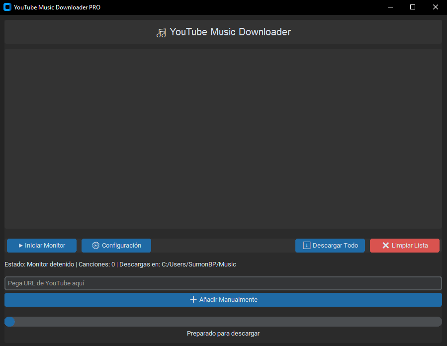

# YouTube Music Downloader PRO 🎵



Aplicación para descargar audio desde YouTube con interfaz intuitiva y funciones avanzadas.

## Características ✨
- 🎶 Descarga automática al reproducir en navegador
- 📁 Selección de carpeta personalizada
- 🎧 Calidad de audio 320kbps
- 📊 Barra de progreso en tiempo real
- 📚 Historial de descargas persistente
- 🎨 Modo oscuro

## Requisitos 💻
```bash
Python 3.8+
yt-dlp >= 2023.7.6
customtkinter >= 5.2.1
FFmpeg (incluido en Windows)

Instalación ⚙️
Instalar dependencias:
```bash
pip install -r requirements.txt

Uso 🚀
```bash
python main.py

Haz clic en "▶ Iniciar Monitor"

Reproduce música en tu navegador

Las canciones aparecerán automáticamente

Usa "⬇ Descargar Todo" para guardar

Configuración ⚙️
Editar backend/core/config.ini:

```bash
[settings]
default_folder = ~/Music
default_quality = 320
theme = dark

¿Dónde se guardan las descargas?
En la carpeta seleccionada (por defecto ~/Downloads)

# DISCLAIMER / DESCARGO DE RESPONSABILIDAD

## Uso Aceptable
Esta aplicación está diseñada para:
- Pruebas técnicas
- Uso personal offline
- Preservación de contenido propio

## Restricciones
❌ No está permitido:
- Descargar contenido protegido sin autorización
- Redistribuir material descargado
- Usar para fines comerciales

## Responsabilidad
El usuario es el único responsable del contenido que descarga. 
Este proyecto no almacena, distribuye ni fomenta la piratería.

[Consulta las leyes de copyright en tu país](https://www.wipo.int/copyright/es/)

Licencia 📜
MIT License - Ver LICENSE

⚠️ Nota: Para el monitoreo automático, mantén el navegador Brave/Chrome abierto mientras reproduces música.
