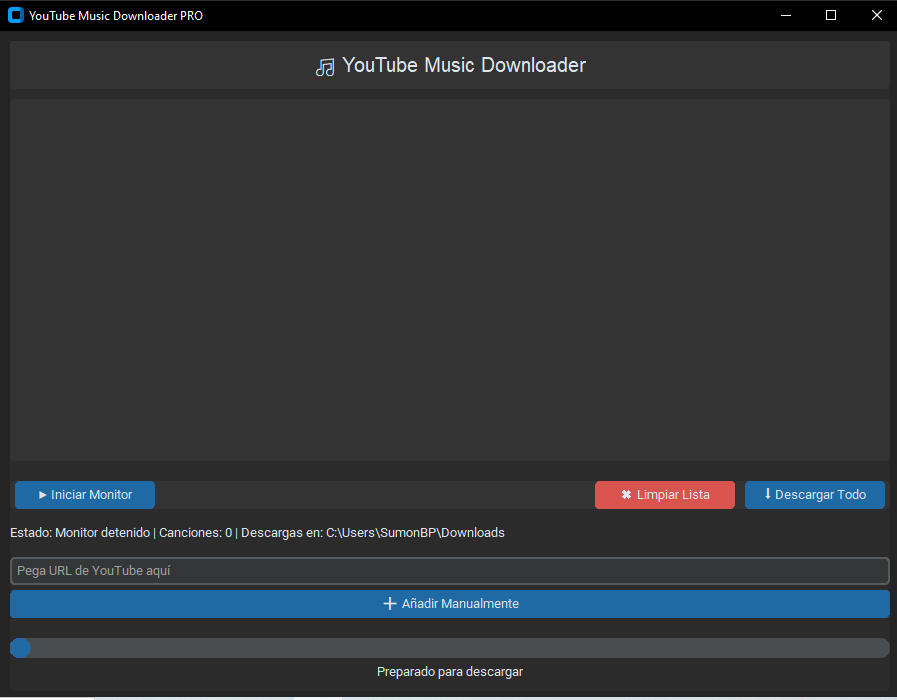

# YouTube Music Downloader PRO 🎵



Aplicación para descargar audio desde YouTube con interfaz intuitiva y monitoreo automático.

## Características ✨
- 🎶 Monitoreo automático de reproducción en navegador Brave/Chrome
- 📁 Selección de carpeta destino personalizada
- 🎧 Calidad de audio configurable (64kbps a 320kbps)
- 📊 Barra de progreso en tiempo real
- 📚 Historial de descargas persistente en formato JSON
- 🎨 Temas oscuro/claro personalizables

## Requisitos 💻
### Básicos
```bash
Python 3.8+
yt-dlp >= 2023.11.16
customtkinter >= 5.2.1
```

### Para el monitor automático
```bash
selenium >= 4.10.0
Brave Browser (o Chrome) instalado
ChromeDriver compatible
FFmpeg (incluido en Windows)
```

## 🔍 Configuración del Monitor
1. Descarga ChromeDriver compatible con tu versión de Brave/Chrome
2. Verifica tu versión en `brave://version` o `chrome://version`
3. Descarga desde: [chromedriver.chromium.org](https://chromedriver.chromium.org)
4. Coloca el archivo en:
```bash
/backend/core/chromedriver.exe
```
📌 *El monitor usa tu perfil de navegador para mantener sesiones activas*

## Instalación ⚙️
Clonar repositorio:
```bash
git clone https://github.com/tu-usuario/youtube-music-downloader.git
cd youtube-music-downloader
```
Instalar dependencias:
```bash
pip install -r requirements.txt
```

## Uso Básico 🚀
```bash
python main.py
```
1. (Opcional) Seleccionar carpeta destino con "📁 Seleccionar"
2. Iniciar monitor con "▶ Iniciar Monitor"
3. Reproducir música en tu navegador Brave/Chrome
4. Las canciones aparecerán automáticamente en la lista
5. Usar "⬇ Descargar Todo" para guardar los audios

## Configuración ⚙️
Editar `backend/core/config.ini`:
```ini
[settings]
default_folder = ~/Music  # Carpeta por defecto
default_quality = 320  # 64|128|192|256|320 kbps
theme = dark  # dark|light|system
```

## Solución de Problemas 🔧
Si el monitor no detecta canciones:
- Cierra todas las instancias de Brave/Chrome antes de iniciar
- Verifica que las versiones de Brave y ChromeDriver sean compatibles
- Revisa que no haya extensiones bloqueando la detección

## ⚠️ Descargo de Responsabilidad
Este software es solo para uso personal y educativo:

✅ Solo descarga contenido que tengas derecho a usar  
⚖️ Respeta los Términos de Servicio de YouTube  
🚫 No redistribuyas contenido protegido por derechos de autor  

📌 *El desarrollador no se hace responsable del mal uso de esta herramienta.*  
📌 *Consulta las leyes de copyright en tu país*

## Licencia 📜
MIT License - Ver archivo LICENSE

📅 Última actualización: 25/11/2023  
🔢 Versión: 1.0.0  

ℹ️ *Para el monitoreo automático, mantén el navegador abierto mientras reproduces música.*
