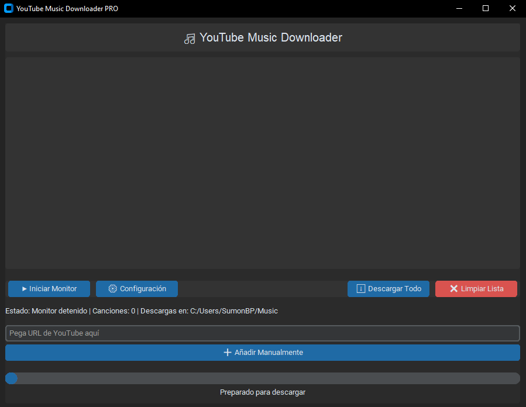

# YouTube Music Downloader PRO 🎵



Aplicación para descargar audio desde YouTube mediante una interfaz gráfica intuitiva, con monitoreo automático de reproducción y gestión de descargas.

---

## Características ✨

* 🎶 Monitoreo automático de reproducción en Brave/Chrome
* 📁 Selección de carpeta de destino personalizada
* 🎧 Calidad de audio configurable (64 kbps a 320 kbps)
* 📊 Barra de progreso en tiempo real
* 📚 Historial de descargas persistente en formato JSON
* 🎨 Temas oscuro, claro y automático
* ⚙️ Configuración persistente mediante archivo INI
* 🚀 Descargas múltiples desde una misma sesión

---

## Requisitos 💻

### Básicos

```bash
Python 3.8+
yt-dlp >= 2023.11.16
customtkinter >= 5.2.1
```

### Para el monitor automático

```bash
selenium >= 4.10.0
Brave Browser o Google Chrome
ChromeDriver compatible con la versión instalada
FFmpeg
```

---

## Instalación ⚙️

### Clonar el repositorio

```bash
git clone https://github.com/tu-usuario/youtube-music-downloader.git
cd youtube-music-downloader
```

### Instalar dependencias

```bash
pip install -r requirements.txt
```

---

## Configuración del Monitor 🔍

1. Verifica la versión de Brave o Chrome:

```text
brave://version
```

o

```text
chrome://version
```

2. Descarga una versión compatible de ChromeDriver.

3. Coloca el ejecutable en:

```bash
/backend/core/chromedriver.exe
```

4. Inicia la aplicación.

📌 El monitor utiliza tu perfil de navegador para detectar automáticamente la reproducción de contenido.

---

## Uso Básico 🚀

Ejecuta:

```bash
python main.py
```

### Flujo recomendado

1. Selecciona la carpeta de destino.
2. Presiona **▶ Iniciar Monitor**.
3. Reproduce música en Brave o Chrome.
4. Las canciones detectadas aparecerán automáticamente en la lista.
5. Presiona **⬇ Descargar Todo** para iniciar las descargas.

También puedes añadir enlaces manualmente utilizando el campo de URL.

---

## Configuración ⚙️

Archivo:

```ini
config.ini
```

Ejemplo:

```ini
[settings]
default_folder = ~/Music
default_quality = 320
theme = dark

monitor_browser = brave
browser_path = C:\Program Files\BraveSoftware\Brave-Browser\Application\brave.exe
chromedriver_path = backend/core/chromedriver.exe
user_profile = Default
monitor_delay = 5
debug_port = 9222
```

---

## Solución de Problemas 🔧

### El monitor no detecta canciones

* Verifica que ChromeDriver sea compatible con tu navegador.
* Cierra todas las instancias de Brave o Chrome antes de iniciar el monitor.
* Comprueba que ninguna extensión esté interfiriendo con Selenium.
* Revisa los mensajes de error mostrados en la consola.

### Error de versión de ChromeDriver

Ejemplo:

```text
This version of ChromeDriver only supports Chrome version XXX
Current browser version is YYY
```

Solución:

* Descarga la versión correcta de ChromeDriver para tu navegador.
* Sustituye el ejecutable existente.

### Error al descargar contenido

* Verifica tu conexión a Internet.
* Actualiza yt-dlp:

```bash
pip install -U yt-dlp
```

* Comprueba que FFmpeg esté disponible.

---

## Aviso Importante sobre Plataformas de Terceros ⚠️

El funcionamiento de esta aplicación depende de servicios y plataformas de terceros, cuyos cambios pueden afectar la compatibilidad del software.

El uso de este proyecto puede estar sujeto a los Términos de Servicio de YouTube u otras plataformas compatibles. Es responsabilidad exclusiva del usuario asegurarse de cumplir dichos términos.

---

## Descargo de Responsabilidad ⚠️

Este proyecto se proporciona únicamente con fines educativos, de investigación y para uso personal legítimo.

El usuario es el único responsable de asegurarse de que posee los derechos, permisos o licencias necesarios para acceder, descargar, almacenar o utilizar cualquier contenido obtenido mediante este software.

El uso de esta herramienta debe realizarse de conformidad con:

* Las leyes de propiedad intelectual y derechos de autor aplicables.
* Los términos y condiciones de las plataformas utilizadas.
* La normativa vigente en el país o jurisdicción del usuario.

El autor de este proyecto no promueve, fomenta ni respalda:

* La infracción de derechos de autor.
* La distribución no autorizada de contenido protegido.
* La utilización ilegal de material obtenido mediante este software.

Este software se proporciona "TAL CUAL" ("AS IS"), sin garantías de ningún tipo, expresas o implícitas.

En ningún caso el autor será responsable por daños, reclamaciones, pérdidas, responsabilidades o consecuencias derivadas del uso o mal uso de este software.

---

## Licencia 📜

Distribuido bajo la licencia MIT.

Consulta el archivo:

```text
LICENSE
```

para obtener el texto completo de la licencia.

---

## Contribuciones 🤝

Las contribuciones, reportes de errores y sugerencias son bienvenidas.

Si encuentras un problema o deseas proponer una mejora, abre un Issue o Pull Request.

---

## Información del Proyecto ℹ️

Versión: 1.0.0

Para el monitoreo automático, mantén el navegador abierto mientras reproduces contenido compatible.
